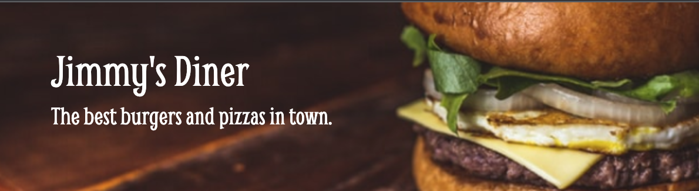
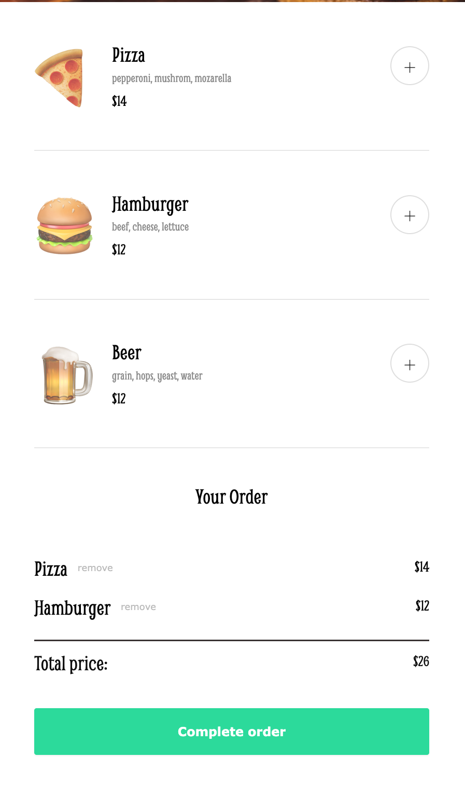
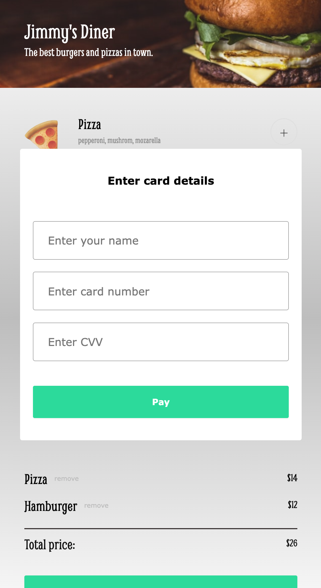

Sample Food Ordering App built as a solo project after completing module 5 of [The Frontend Developer Career Path](https://scrimba.com/learn/frontend) on Scrimba. It won't deliver any food (or beer), but you can [check it out]() to see what I learned recently during the course!

## What you can do:
Surprisingly... you can make your order! There are three options to choose from, and you can add as many burgers as you wish. Also, feel free to change your mind and remove any items you're no longer interested in. To finalize your order, you should make your "payment".

## What I've learned and used:
I followed the provided design – you can compare my app with the Figma file included in this repo. This time, I used `box-sizing: border-box` property. I pushed the addItem button to the right side of the page (the power of `margin` when `parentElement` is set to `display: flex`). I also created a modal with a `<form>` inside and set up the background as a `linear-gradient`.

In `JavaScript`, I rendered the menu and learned about the `.reduce` method. I captured the payment details using `FormData`. I also practiced using the `data attributes`, `e.preventDefault()`, `.forEach`, `.filter`, `.splice`, and `.push` methods, among many more.

## What it looks like:
| With a few items ordered | The Payment Modal |
| --- | ---|
| |  |
